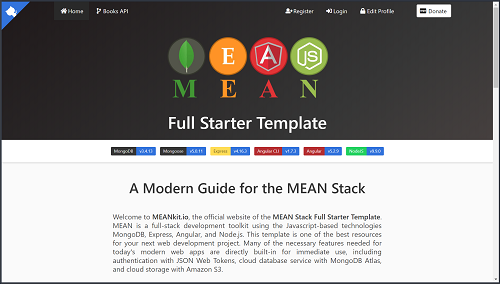

    

# MEAN Stack Full Starter Template

     
    <a href="https://www.meankit.io" target="_blank">MEANkit.io</a>

### Last Update: 3/21/2018
The MEAN Stack Full Starter Template is one of the best resources for your next web development project!  MEAN is a full-stack development toolkit using the Javascript-based technologies MongoDB, Express, Angular, and Node.js.  Many of the necessary features needed for today's modern web apps are directly built-in for immediate use, including **authentication with JWT**, cloud database service with **MongoDB Atlas**, cloud storage with **Amazon S3**, integration with the **Stripe API**, and server-side rendering with **Angular Universal** for SEO and social media compatibility.

## Versions
* MongoDB v3.4.13 (Mongoose v5.0.11)
* Express v4.16.3
* Angular v5.2.9 (Angular CLI 1.7.3)
* Node.js v9.9.0

## Installation
1. Clone this repo: `git clone https://github.com/stanleyeosakul/mean-full-starter`
1. `cd` into this repository
1. Run `yarn install` to install dependencies
1. In `/node_src/config`, add all your API keys into `keys.js`
1. In `/src/environments`, add your stripe publishable API key into `environment.ts` and `environment.prod.ts`
1. Run `yarn run build-prod`
1. Navigate to `http://localhost:3000`

## Development vs. Production Server
1. Choose to run the development or production server
  * Development
    * Front End (Angular)
      * Run `yarn run serve`, and navigate to `http://localhost:4200/`. 
    * Back End (MongoDB, Express, Node.js)
      * Run `yarn start`, and navigate to `http://localhost:3000/`.
  * Production
    * Run `yarn run build-prod`, and navigate to `http://localhost:3000/`.

## Built-in scripts
* `yarn run build`
  * Builds the Angular project into the `dist/` folder without build optimization
  * Builds the Angular Universal server into the `dist-server/` folder
* `yarn run build-prod`
  * Runs `yarn run build` as above
  * Runs the `server.js` node app
* `yarn serve`
  * Runs the development server `ng serve --aot`
* `yarn start`
  * Runs the `server.js` node app

## Installed Packages
### Front-end
* Angular
* [Bulma CSS Framework](https://bulma.io/)
* [Font-Awesome 5](https://fontawesome.com/)
* [@ngx-share](https://murhafsousli.github.io/ngx-sharebuttons)

### Back-end
* Express
* Mongoose
* Multer
* Multer-S3

### 3rd party APIs
* AWS-SDK
* Stripe

### Server-side Rendering
* Angular Universal
* Zone.js
* Angular Platform Server
* ngUniversal Express Engine
* ngUniversal Module Map ngFactory Loader

### Development and Testing
* Angular CLI v1.7.3
* Morgan Logging library
* Typescript
* Karma
* Protractor
* Jasmine
